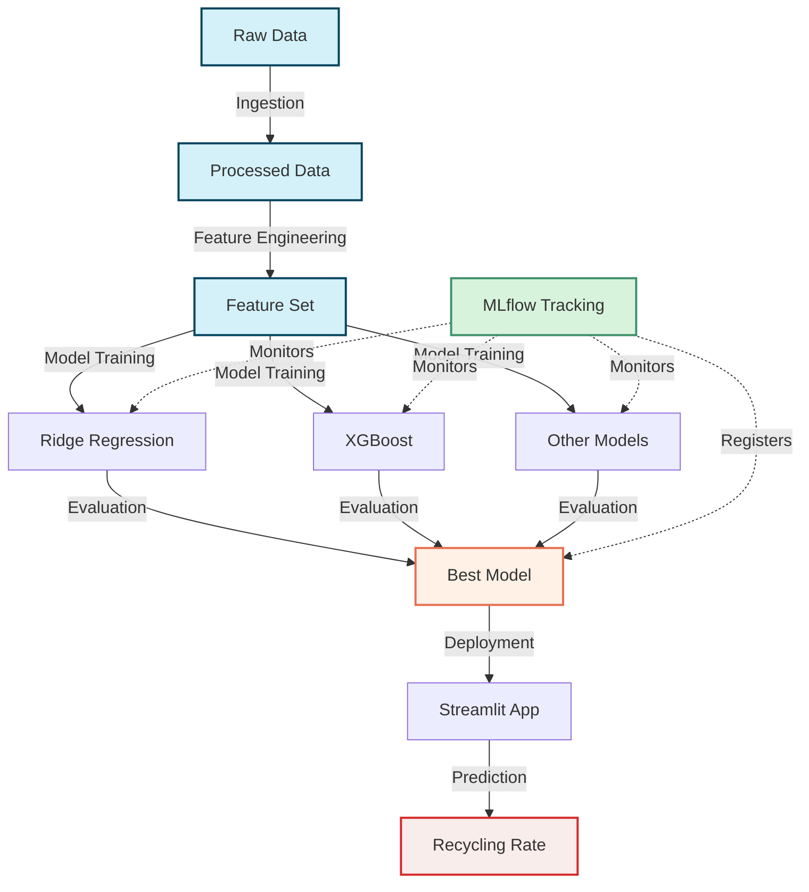

# ♻️ Indian Cities Waste Management & Recycling Prediction

<div style="
  text-align: center; 
  color: white; 
  background: linear-gradient(135deg, #2e8b57, #3cb371); 
  padding: 25px; 
  border-radius: 12px;
  box-shadow: 0 4px 10px rgba(0,0,0,0.2);
  max-width: 600px;
  margin: 30px auto;
">
  <h1 style="margin: 0; font-size: 2.2em;">Waste Management ML Model Training</h1>
  <p style="font-size: 18px; margin-top: 8px; opacity: 0.95;">
    Predicting recycling rates with preprocessing pipelines and advanced models
  </p>
</div>

## Project Overview

This project addresses the critical challenge of waste management and recycling in Indian cities through data science and machine learning. By analyzing urban waste management practices, we've created a predictive model that estimates recycling rates based on key infrastructure and technology adoption metrics.

The solution enables city planners, environmental agencies, and policymakers to:
- Predict recycling rates based on current infrastructure and green technology adoption
- Identify critical factors affecting recycling success
- Simulate different scenarios for improved waste management planning

## 🏆 Hackathon Context

This project was developed for the Data Science August Mini-Hackathon focusing on Waste Management and Recycling in Indian Cities. The goal was to build an end-to-end machine learning solution addressing the pressing environmental challenge of urban waste management in India.

##  Project Architecture



### Key Components:

1. **Data Ingestion Pipeline**: Automated process for data collection, cleaning and preparation
2. **Feature Engineering**: Creation of meaningful predictive variables
3. **Model Training Pipeline**: Experimentation, validation and model selection process
4. **Prediction System**: Interactive web application for predictions and scenario planning
5. **MLflow Integration**: Model tracking and experiment management

##  Dataset

The project utilizes a comprehensive dataset of Indian cities with waste management metrics:

- City/district information
- Waste generation volumes
- Current recycling rates
- Population density
- Municipal efficiency scores
- Waste disposal methods
- Management costs
- Environmental awareness metrics
- Infrastructure ratings (additional_collected)
- Green technology adoption rates (additional_collected)

##  Model Development

### Feature Selection:
After extensive analysis, we identified three key predictive features:
- City/District (location-specific factors)
- Green Technology Adoption (percentage score)
- Recycling Infrastructure Rating (percentage score)

### Model Comparison:
Multiple regression algorithms were evaluated, including:
- Linear Regression
- Ridge Regression
- Random Forest
- XGBoost
- CatBoost
- LightGBM

### Final Model:
The final selected model is a Ridge Regression with feature selection, providing:
- Strong predictive performance
- Interpretability for stakeholders
- Efficient computation for deployment

## 🚀 Getting Started

### Prerequisites
```
Python 3.10+
conda (recommended for environment management)
```

### Installation

1. Clone this repository
```bash
git clone https://github.com/yourusername/hackthon_waste_mgmt.git
cd hackthon_waste_mgmt
```

2. Create and activate the conda environment
```bash
conda env create -f config/environment.yml
conda activate waste_hackthon
```

3. Install required packages
```bash
pip install -r requirements.txt
```

4. Run the application
```bash
streamlit run app.py
```

##  Usage

### Web Application
The Streamlit web application provides an intuitive interface for:
1. Selecting an Indian city/district
2. Setting green technology adoption levels
3. Setting recycling infrastructure ratings
4. Generating recycling rate predictions
5. Receiving sustainability recommendations


### Training Pipeline
To train a new model with updated data:
```bash
python run_pipeline.py
```

## 📁 Project Structure

```
├── app.py                  # Streamlit web application
├── requirements.txt        # Python dependencies
├── run_pipeline.py         # End-to-end training pipeline
├── setup.py                # Project installation script
├── artifacts/              # Trained models and preprocessors
├── config/                 # Configuration files
├── data/                   # Raw and processed datasets
│   ├── raw/
│   └── processed/
├── logs/                   # Application logs
├── mlruns/                 # MLflow experiment tracking
├── models/                 # Saved production models
├── Notebooks/              # Jupyter notebooks for exploration
│   ├── data_preparation.ipynb
│   ├── exploratory_data_analysis.ipynb
│   └── model_training_01.ipynb
├── reports/                # Generated reports and visualizations
└── src/                    # Source code
    ├── data/               # Data processing modules
    ├── model_pipeline/     # Model training and prediction
    └── utils/              # Utility functions
```

## Tech Stack Used

1. Python
2. streamlit
3. Machine learning algorithms
4. Datatool kit
5. mlflow


##  License

### This project is licensed under the Utkarsh Pandey - see the LICENSE file for details.
Developed with ❤️ for sustainable urban waste management in India
